<!-- ===================== HEADER ===================== -->

<h1 align="center">Hi 👋, I'm Saurabh Rai</h1>

<h3 align="center">
Computer Science & Engineering Student • AI/ML • Deep Learning • Computer Vision
</h3>

  

  
  

<!-- ===================== ABOUT ME ===================== -->

## 👨‍💻 About Me

🎓 **4th Year Computer Science & Engineering Student** at **JAIN (Deemed-to-be University)**

🤖 Passionate about **Artificial Intelligence, Machine Learning & Deep Learning**

👁️ Interested in **Computer Vision, Image Processing & Video Analysis**

🐍 Building projects using **Python and Deep Learning frameworks**

🧠 Exploring **CNNs, Machine Learning models and intelligent systems**

💻 Interested in developing practical solutions through **software and AI**

📚 Currently learning, building and experimenting with new technologies

🚀 Always curious about how technology can solve real-world problems

<!-- ===================== WHAT I WORK WITH ===================== -->

## 🧠 What I Work With

<table>
<tr>
<td width="50%" valign="top">

### 🤖 Artificial Intelligence

- Machine Learning
- Deep Learning
- Convolutional Neural Networks
- Computer Vision
- Image Classification
- Video Analysis
- Model Training & Validation
- Data Preprocessing
- Data Augmentation

</td>

<td width="50%" valign="top">

### 💻 Computer Science

- Python Programming
- Java
- JavaScript
- Data Structures & Algorithms
- DBMS
- MySQL
- Computer Networks
- Web Development

</td>
</tr>
</table>

<!-- ===================== PROJECTS ===================== -->

## 🚀 Featured Projects

### 🎥 Anomaly Detection in CCTV Footage
#### *Deep Learning & Computer Vision*

My **final-year B.Tech research project** focused on developing an automated system for detecting unusual activities in CCTV footage using Deep Learning and Computer Vision. :contentReference[oaicite:1]{index=1}

**Key areas explored:**

- 🧠 Convolutional Neural Networks (CNN)
- 🔄 Recurrent Neural Networks (RNN)
- ⏱️ LSTM for temporal sequence analysis
- 🎯 Transfer Learning
- 👁️ Attention Mechanisms
- 🎞️ Video & Frame Processing
- 📊 Model Training & Validation
- 📈 Precision, Recall & F1-Score
- 🔍 Confusion Matrix & Error Analysis

The research explores combining spatial feature extraction from CNNs with temporal modelling through RNN-based approaches to distinguish normal and anomalous events. :contentReference[oaicite:2]{index=2}

**Potential applications:**

`Security & Surveillance` • `Industrial Monitoring` • `Retail & Commercial Spaces`

---

### 😊 EmotionSenseAI
#### *Real-Time Emotion Detection*

A Deep Learning and Computer Vision project designed to detect human emotions from facial expressions in real time.

**Technologies:**

`Python` `TensorFlow` `Keras` `CNN` `OpenCV`

**Highlights:**

- 🎯 Facial emotion classification
- 👁️ Face detection using Haar Cascade
- 🖼️ 48×48 grayscale image processing
- 🧠 CNN-based prediction
- 🔄 Data augmentation
- 🎥 Real-time prediction using OpenCV

---

### 👤 Face Recognition Attendance System

A Python-based attendance management system using face recognition and OpenCV.

**Features:**

- 👤 Face detection & recognition
- 📝 Student registration
- 📅 Automated attendance
- 🖥️ GUI using Tkinter
- 📊 Attendance data management

<!-- ===================== TECH STACK ===================== -->

## 🛠️ Technologies & Tools

<!-- ===================== GITHUB STREAK ===================== -->

## 🔥 GitHub Streak

  

---

<!-- ===================== GITHUB STATS ===================== -->

## 📊 GitHub Stats

  
  

&nbsp;&nbsp;
&nbsp;&nbsp;
&nbsp;&nbsp;
&nbsp;&nbsp;

<!-- ===================== FOOTER ===================== -->

   
  <b>💻 Code • 🤖 Learn • 🧠 Build • 🚀 Innovate</b>

  ⭐ Thanks for visiting my profile!

